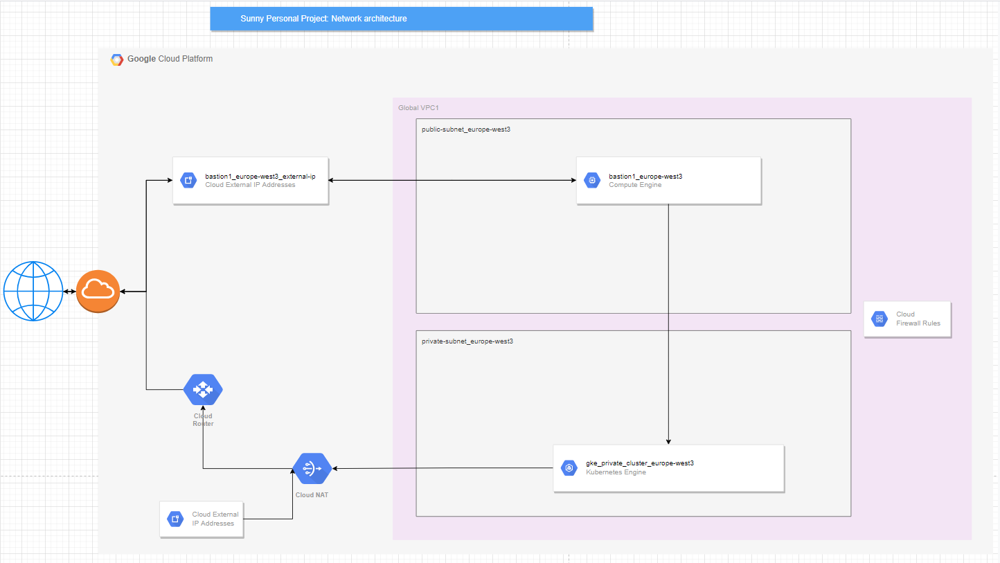

# Architecture




# Pre-setup

Create a GCP account.

##### Cloud Shell

I prefer to use cloud shell for initial setup as all the commonly used tools are already setup there.

Click on `Activate Cloud Shell` from gcp console. You might need to click `Authorize` for some operations.

##### Set env vars

Feel free to set your own values here.

```
export PROJECT_NAME="sunny-tf-gcp-5"   # This value should be unique across all projects ever created
export SERVICE_ACCOUNT_NAME="tf-gcp-sa"
export SERVICE_ACCOUNT_ROLES=("roles/storage.admin" "roles/compute.admin" "roles/container.admin" "roles/iam.serviceAccountUser")
export GCS_BUCKET_NAME="tf-state-dev-$PROJECT_NAME"
export GCS_BUCKET_LOCATION="EUROPE-WEST4"
```

##### Create Project

```
gcloud projects create $PROJECT_NAME \
--set-as-default

gcloud config set project $PROJECT_NAME
```

NOTE: You will need to setup a Billing account before proceeding further.

##### Create Service Account

```
gcloud iam service-accounts create $SERVICE_ACCOUNT_NAME \
--description "Terraform service account" \
--display-name $SERVICE_ACCOUNT_NAME
```

##### Give some permissions to the service account

```
for role in "${SERVICE_ACCOUNT_ROLES[@]}"; do
  gcloud projects add-iam-policy-binding $PROJECT_NAME \
  --member="serviceAccount:$SERVICE_ACCOUNT_NAME@$PROJECT_NAME.iam.gserviceaccount.com" \
  --role="$role";
done

gcloud projects get-iam-policy $PROJECT_NAME
```

##### Create key for the service account

```
gcloud iam service-accounts keys create "$SERVICE_ACCOUNT_NAME-key.json" \
--iam-account="$SERVICE_ACCOUNT_NAME@$PROJECT_NAME.iam.gserviceaccount.com"
```

- Download the key to your local machine.
- DO NOT SHARE IT WITH ANYBODY.
- DO NOT PUT IT IN ANY VERSION CONTROL SYSTEM LIKE GITHUB, GITLAB, GERRIT, SVN ETC.

##### Billing account (Manually)

- Create a billing account
- Link it to the project

##### Make GCS bucket

```
gsutil mb \
-p $PROJECT_NAME \
-l $GCS_BUCKET_LOCATION \
gs://$GCS_BUCKET_NAME

gsutil versioning set on gs://$GCS_BUCKET_NAME

gsutil ls -p $PROJECT_NAME
```

##### Enable required APIs

```
service_apis=("cloudresourcemanager" "cloudbilling" "iam" "compute" "container" "dns")

for svc in ${service_apis[@]}; do
  gcloud services enable $svc.googleapis.com;
done
```

## On local workstation

- Install terraform
- Install [gcloud cli](https://cloud.google.com/sdk/docs/install)
- `gcloud init`
- `gcloud auth login`
- `gcloud auth application-default login`

# Steps to use this setup

Set appropriate values in `input_values.auto.tfvars` file.

```
terraform init
terraform fmt -recursive
terraform validate
terraform plan -out actions.plan
terraform apply actions.plan
```
